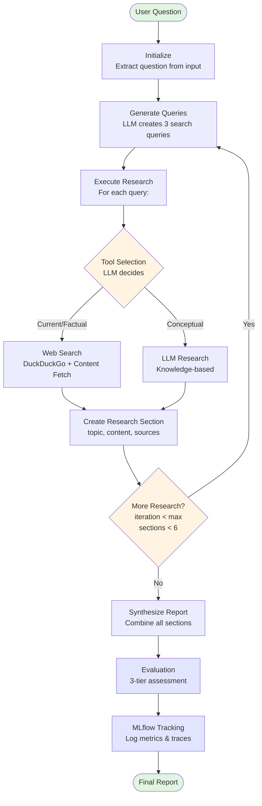

# Deep Research Agent

A LangGraph-based deep research agent that uses OpenAI LLMs to perform comprehensive research on any topic, with integrated evaluation, MLflow tracking, and structured logging for full observability.

## Features

- **Deep Research Pattern**: Multi-iteration research workflow with query generation, tool selection, research execution, and synthesis
- **LangGraph Integration**: Built on LangGraph's StateGraph for structured agent workflows
- **OpenAI LLMs**: Uses OpenAI models for research, synthesis, and intelligent tool selection
- **Web Search Integration**: DuckDuckGo-based web search with parallel content fetching for current information
- **Intelligent Tool Selection**: LLM-driven decision making to choose between web search and knowledge-based research
- **Comprehensive Evaluation System**: Three tiers of evaluators to assess report and reasoning quality
  - **Basic Evaluators**: Length and structure validation (synchronous)
  - **LLM Evaluators**: Relevance and completeness assessment (async)
  - **Reasoning Evaluators**: Plan quality, adherence, source quality, tool selection, and comprehensive reasoning trace analysis
- **MLflow Tracking**: Automatic experiment tracking with LLM tracing, metrics, and artifact storage
- **Structured Logging**: JSON and colored console logging with structlog for observability
- **Configurable**: Customize model, iterations, research depth, and evaluation criteria

## Installation

```bash
# Clone the repository
git clone <repository-url>
cd deepeval-example

# Install dependencies with uv
uv sync

# For development (includes test dependencies)
uv sync --extra dev
```

## Configuration

1. Copy the example environment file:
   ```bash
   cp .env.example .env
   ```

2. Edit `.env` and configure the following:
   ```bash
   # Required: OpenAI API key
   OPENAI_API_KEY=your-api-key-here

   # Optional: OpenAI model (defaults to gpt-4o-mini)
   OPENAI_MODEL=gpt-4o-mini

   # Optional: Logging configuration
   LOG_LEVEL=INFO  # DEBUG, INFO, WARNING, ERROR, CRITICAL
   LOG_FORMAT=console  # "json" for JSON output, anything else for colored console

   # Optional: MLflow tracking (defaults to sqlite:///mlflow.db)
   MLFLOW_TRACKING_URI=sqlite:///mlflow.db
   ```

## Usage

### Command Line

The CLI automatically runs research with evaluation and MLflow tracking:

```bash
# Run with a question as argument
uv run python main.py "What are the key principles of machine learning?"

# Or run interactively
uv run python main.py
```

After running, view detailed results including LLM traces in the MLflow UI:

```bash
mlflow ui
# Then open http://localhost:5000
```

### Programmatic Usage

```python
from src.deep_research import (
    run_research_with_evaluation,
    run_research,
    create_research_agent,
)

# Full evaluation with MLflow tracking (recommended)
result = run_research_with_evaluation(
    "What is quantum computing?",
    max_iterations=2,
    include_llm_evaluators=True,
    include_reasoning_evaluators=True,
)
print(result.report)
for eval in result.evaluations:
    print(f"{eval.name}: {eval.score:.2f} ({'PASS' if eval.passed else 'FAIL'})")

# Simple usage without evaluation
report = run_research("What is quantum computing?", max_iterations=2)
print(report)

# Advanced usage with custom agent
agent = create_research_agent(model_name="gpt-4o", max_iterations=3)
result = agent.invoke({
    "messages": [],
    "question": "Explain neural networks",
    "search_queries": [],
    "research_sections": [],
    "final_report": "",
    "iteration": 0,
    "max_iterations": 3,
})
print(result["final_report"])
```

## Architecture

The agent follows the deep research pattern with integrated evaluation and tracking:

### Core Research Flow



### Research Tools

The agent uses multiple specialized tools orchestrated by LangGraph:

1. **Query Generator** (`create_query_generator`)
   - Generates 3 diverse search queries from the research question
   - Uses LLM to decompose complex questions into focused sub-queries
   - Ensures comprehensive coverage of the topic

2. **Tool Selector** (`select_research_tool`)
   - LLM-driven decision making for each query
   - Chooses between `web_search` and `llm` based on query characteristics
   - First query always uses web search for current information

3. **Web Search** (`create_web_search_tool`)
   - DuckDuckGo text search (no API key required)
   - Parallel content fetching for top 3 results using trafilatura
   - Returns formatted content with source URLs
   - Configurable retry logic for rate limiting
   - Max 5 results per query

4. **Deep Research** (`create_deep_research_tool`)
   - LLM-based research using OpenAI models
   - Used for conceptual or explanatory queries
   - Leverages model's knowledge base

5. **Synthesizer** (`create_synthesizer`)
   - Combines all research sections into a cohesive report
   - LLM ensures logical flow and removes redundancy
   - Generates structured markdown output

### Evaluation System

The system implements a comprehensive 3-tier evaluation framework:

#### Tier 1: Basic Evaluators (Synchronous)
- **LengthEvaluator**: Validates minimum word count (100) and character count (500)
- **StructureEvaluator**: Checks for markdown headings, introduction, and conclusion

#### Tier 2: LLM-Based Evaluators (Async)
- **RelevanceEvaluator**: Assesses if report addresses the research question (0.0-1.0 scale)
- **CompletenessEvaluator**: Evaluates depth and coverage of key aspects

#### Tier 3: Reasoning Evaluators (Requires Plan + Execution Context)
These evaluators assess the agent's internal reasoning process, not just outputs:

- **PlanQualityEvaluator**: Evaluates the quality of generated search queries
  - Logical coherence and coverage
  - Efficiency and appropriate granularity

- **PlanAdherenceEvaluator**: Checks if execution followed the plan
  - Compares planned queries vs. actual research sections
  - Identifies deviations and completeness

- **SourceQualityReasoningEvaluator**: Assesses source diversity and quality
  - Counts unique sources and domains
  - Tracks web search vs. LLM usage

- **ToolSelectionEvaluator**: Evaluates appropriateness of tool choices
  - Web search for factual/current queries
  - LLM for conceptual queries

- **ReasoningTraceEvaluator**: Comprehensive reasoning analysis across 6 dimensions
  - Logical Coherence: Do queries follow rationally?
  - Goal Alignment: Are queries directed toward the question?
  - Efficiency: Avoiding redundancy and waste
  - Reasoning Faithfulness: Does execution align with plan?
  - Intermediate State Accuracy: Proper fact identification
  - Hypothesis Generation: Exploring alternatives systematically
  - Based on principles from "Evaluating Reasoning and Planning in Agentic LLM Systems"

### State Management

The agent maintains state through `ResearchState` (TypedDict):
- `messages`: Conversation history
- `question`: Original research question
- `search_queries`: Generated queries (the plan)
- `research_sections`: Execution results with metadata
  - `topic`, `content`, `sources`, `tool_used`, `source_count`
- `final_report`: Synthesized output
- `iteration`: Current iteration count
- `max_iterations`: Maximum iterations allowed

### Observability

- **Structured Logging**: All operations logged with structlog for debugging and monitoring
- **MLflow Tracking**: Automatic experiment tracking with:
  - LLM traces for every API call
  - Metrics for iteration count, section count, and evaluation scores
  - Artifacts including the final report and original question
  - Evaluation metadata and pass/fail rates
  - Reasoning evaluation dimensions and explanations

## Testing

```bash
# Run all tests
uv run pytest

# Run with verbose output
uv run pytest -v

# Run specific test file
uv run pytest tests/test_agent.py -v
```

## Linting

```bash
# Run ruff linter
uv run ruff check .

# Run ruff formatter
uv run ruff format .

# Auto-fix linting issues
uv run ruff check --fix .
```

## Pre-commit Hooks

Pre-commit hooks are configured to run tests and linting on each commit.

```bash
# Install pre-commit hooks (first time setup)
uv run pre-commit install

# Run manually on all files
uv run pre-commit run --all-files
```

## Project Structure

```
deepeval-example/
├── main.py                 # CLI entry point with evaluation
├── src/
│   └── deep_research/
│       ├── __init__.py     # Package exports
│       ├── agent.py        # LangGraph agent implementation
│       ├── prompts.py      # LLM prompt templates
│       ├── state.py        # State type definitions
│       ├── tools.py        # Research tools
│       ├── evaluators.py   # Report evaluation system
│       ├── evaluate.py     # Integrated evaluation workflow
│       ├── logging.py      # Structured logging configuration
│       └── tracking.py     # MLflow tracking integration
├── tests/
│   ├── conftest.py         # Test configuration
│   ├── test_agent.py       # Agent tests
│   ├── test_prompts.py     # Prompt tests
│   ├── test_state.py       # State tests
│   ├── test_tools.py       # Tools tests
│   ├── test_evaluators.py # Evaluator tests
│   ├── test_logging.py     # Logging tests
│   └── test_tracking.py    # Tracking tests
├── mlflow.db               # SQLite database for MLflow (created on first run)
├── mlruns/                 # MLflow experiment data and traces
├── .env.example            # Environment template
├── .pre-commit-config.yaml # Pre-commit hooks config
├── .gitignore
├── pyproject.toml
├── CLAUDE.MD               # Project context and learnings
└── README.md
```

## License

MIT
